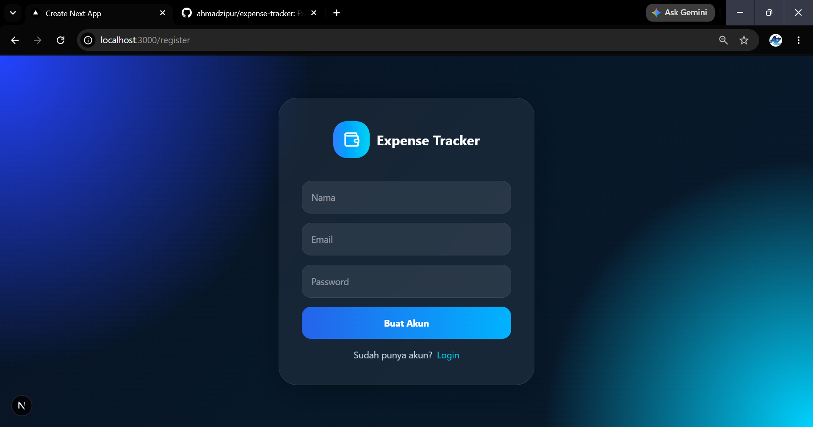
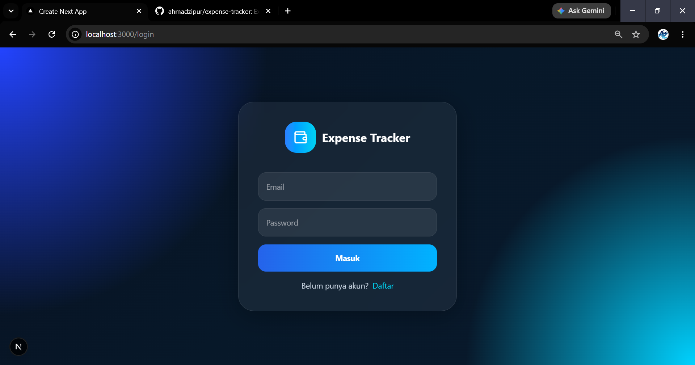
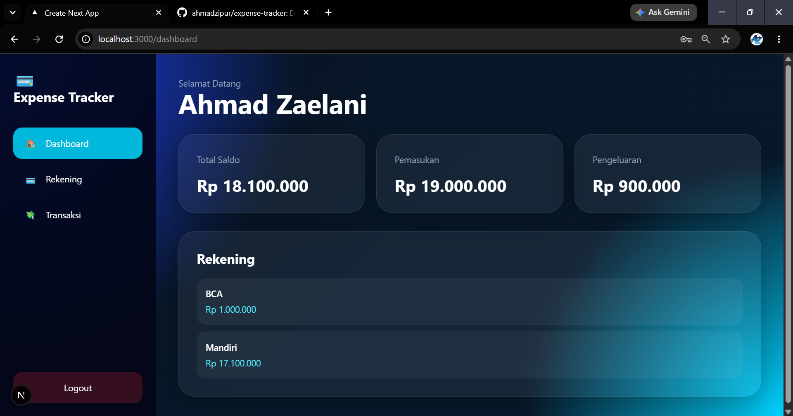
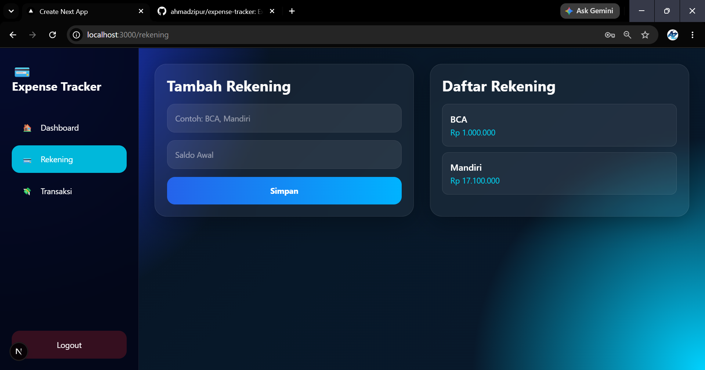
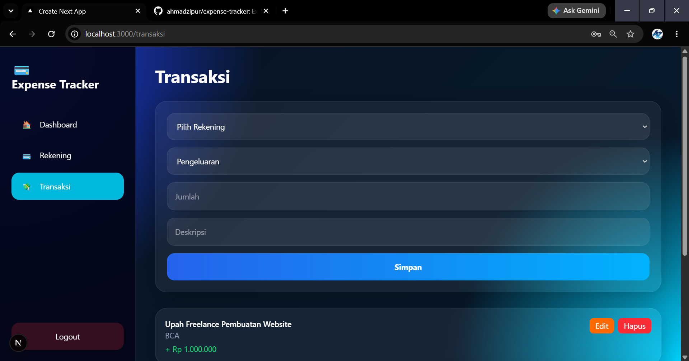
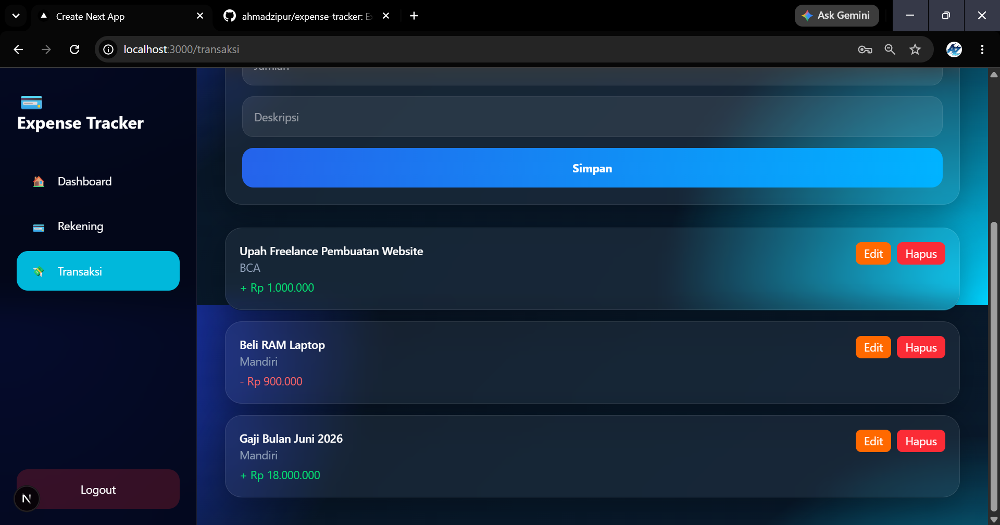

💰 Expense Tracker

Expense Tracker adalah aplikasi web untuk mengelola keuangan pribadi secara sederhana namun powerful. Aplikasi ini memungkinkan pengguna untuk mencatat pemasukan, pengeluaran, serta mengelola beberapa rekening dengan saldo masing-masing.


✨ Fitur Utama

📊 Dashboard
- Menampilkan total saldo keseluruhan
- Menampilkan total pemasukan
- Menampilkan total pengeluaran
- Menampilkan daftar rekening beserta saldo masing-masing

🏦 Halaman Rekening
- Menampilkan daftar semua rekening
- Menampilkan saldo tiap rekening
- Menambahkan rekening baru dengan mudah

💸 Halaman Transaksi
- Menambahkan transaksi pemasukan dan pengeluaran
- Menampilkan daftar transaksi
- Edit transaksi (update rekening, jumlah, tipe, dan deskripsi)
- Hapus transaksi
- Validasi saldo otomatis (tidak bisa minus)

⚙️ Teknologi yang Digunakan
- Next.js (App Router)
- React.js
- PostgreSQL
- Node.js API Routes
- Tailwind CSS (UI Styling)
- JWT Authentication

🧠 Cara Kerja Sistem

Setiap transaksi akan langsung mempengaruhi saldo rekening
Pemasukan akan menambah saldo
Pengeluaran akan mengurangi saldo
Sistem akan menolak transaksi jika saldo tidak mencukupi
Update dan delete transaksi akan otomatis menyesuaikan saldo kembali (rollback logic)


🗂️ Struktur Halaman

/dashboard
  - Total saldo
  - Total pemasukan
  - Total pengeluaran
  - List rekening + saldo

/accounts
  - List rekening
  - Form tambah rekening

/transactions
  - Form tambah transaksi
  - List transaksi
  - Edit & delete transaksi
  
  
🔐 Sistem Keamanan

Autentikasi menggunakan JWT (token di cookies)
Setiap data user dipisahkan berdasarkan user_id
Akses API dilindungi middleware autentikasi


📌 Validasi Sistem

Transaksi pengeluaran tidak boleh melebihi saldo rekening
Rekening harus valid sebelum transaksi diproses
Semua perubahan saldo dilakukan secara transaction-safe (BEGIN / COMMIT / ROLLBACK)


# 🚀 Cara Menjalankan Project

# clone repository
git clone https://github.com/ahmadzipur/expense-tracker.git

# masuk folder
cd expense-tracker

# install dependency
npm install

# jalankan development server
npm run dev

🛠️ Environment Variables

Buat file .env.local:

DATABASE_URL=your_postgres_url
JWT_SECRET=your_secret_key


## 📷 Preview

## 📝 Register Page



## 🔐 Login Page



## 📊 Dashboard



## 🏦 Rekening



## 💸 Transaksi






## 📈 Pengembangan Selanjutnya

- Grafik pengeluaran bulanan
- Export laporan PDF/Excel
- Kategori transaksi
- Budgeting system
- Notifikasi pengeluaran berlebih

## 💻 Author

Ahmad Zaelani
23552011179

Expense Tracker

Smart Finance App (Productivity Tools) – Personal Expense Management System


This is a [Next.js](https://nextjs.org) project bootstrapped with [`create-next-app`](https://github.com/vercel/next.js/tree/canary/packages/create-next-app).

## Getting Started

First, run the development server:

```bash
npm run dev
# or
yarn dev
# or
pnpm dev
# or
bun dev
```

Open [http://localhost:3000](http://localhost:3000) with your browser to see the result.

You can start editing the page by modifying `app/page.js`. The page auto-updates as you edit the file.

This project uses [`next/font`](https://nextjs.org/docs/app/building-your-application/optimizing/fonts) to automatically optimize and load [Geist](https://vercel.com/font), a new font family for Vercel.

## Learn More

To learn more about Next.js, take a look at the following resources:

- [Next.js Documentation](https://nextjs.org/docs) - learn about Next.js features and API.
- [Learn Next.js](https://nextjs.org/learn) - an interactive Next.js tutorial.

You can check out [the Next.js GitHub repository](https://github.com/vercel/next.js) - your feedback and contributions are welcome!

## Deploy on Vercel

The easiest way to deploy your Next.js app is to use the [Vercel Platform](https://vercel.com/new?utm_medium=default-template&filter=next.js&utm_source=create-next-app&utm_campaign=create-next-app-readme) from the creators of Next.js.

Check out our [Next.js deployment documentation](https://nextjs.org/docs/app/building-your-application/deploying) for more details.
